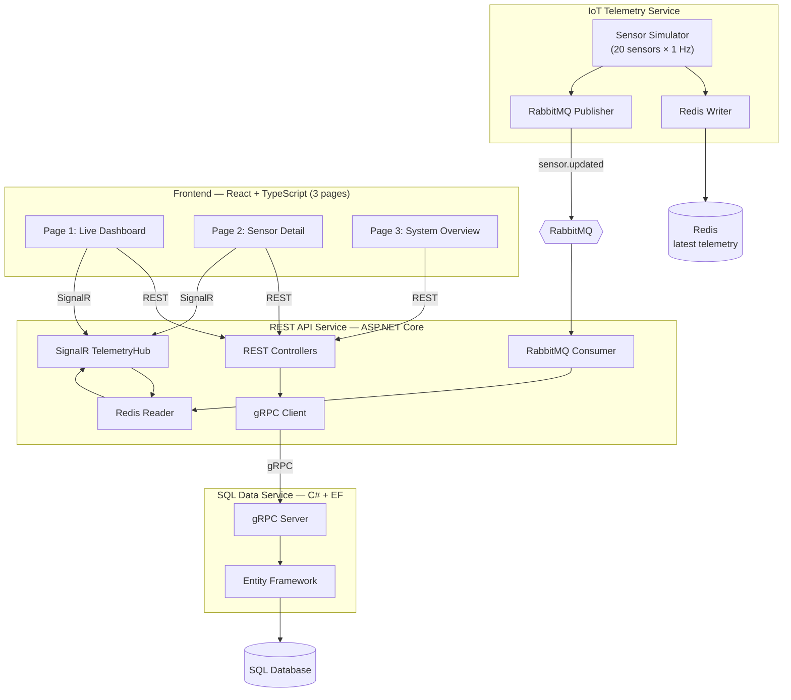
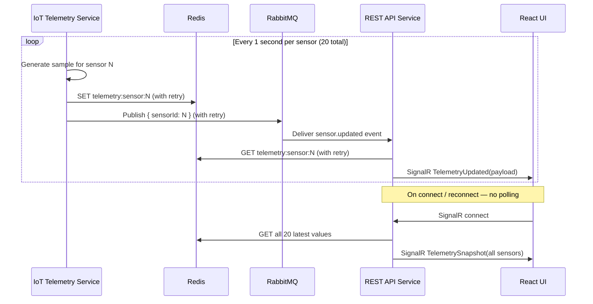
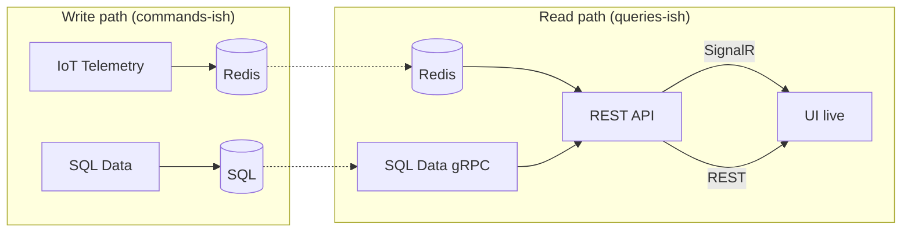

# Phase 0 — System Architecture

This document locks the architecture for the industrial real-time assignment. It aligns with the spec and issuer clarification:

- **IoT writes telemetry to Redis first**; Redis holds the **latest authoritative value** per sensor.
- **SQL Data** and **IoT Telemetry** communicate with **REST API** only via **gRPC** and **RabbitMQ**.
- **UI** uses **REST** and **SignalR** only with **REST API**.

Implementation must follow the communication matrix and **retry rules** in this document.

---

## High-level architecture



---

## Real-time telemetry sequence (happy path)



---

## Component responsibilities

### React UI (Frontend)

| Responsibility | Details |
|---|---|
| Display live telemetry | Dashboard and detail pages use SignalR |
| Load metadata | Sensor list/detail via REST |
| Pages | Exactly 3: Live Dashboard, Sensor Detail, System Overview |
| Constraints | No polling for telemetry |

Does **not** connect to Redis, RabbitMQ, SQL, IoT, or SQL Data.

### REST API Service (Hub)

| Responsibility | Details |
|---|---|
| REST | `/api/sensors`, `/api/sensors/{id}`, health |
| SignalR | `TelemetryUpdated`, `TelemetrySnapshot` on connect |
| RabbitMQ | Consume `sensor.updated` events |
| Redis | Read authoritative latest value per sensor |
| gRPC | Query SQL Data for metadata |

### IoT Telemetry Service

| Responsibility | Details |
|---|---|
| Simulation | Exactly 20 sensors, ~1 sample/sec each |
| Redis | Write latest value **before** publishing notification |
| RabbitMQ | Publish `{ sensorId }` after successful Redis write |

### SQL Data Service

| Responsibility | Details |
|---|---|
| Persistence | EF + SQL, sensor metadata (20 seeded rows) |
| gRPC | `GetSensors()`, `GetSensor(id)` |
| Scope (MVP) | Metadata only; live stream stays in Redis |

### Redis

Source of truth for **latest** telemetry per sensor.

- Key pattern: `telemetry:sensor:{id}`
- Value: JSON `{ sensorId, value, unit, timestamp, status }`

### RabbitMQ

Notification bus only (not telemetry store).

- Exchange: `telemetry.events` (topic or fanout per implementation)
- Routing key: `sensor.updated`
- Body: `{ "sensorId": 7 }`
- Queue: durable, consumed by REST API

### SQL Database

Relational store for sensor metadata behind SQL Data service.

---

## UI pages

| Page | Purpose | REST | SignalR |
|---|---|---|---|
| **Live Dashboard** | All 20 sensors live | Initial metadata | All sensor updates |
| **Sensor Detail** | One sensor deep view | Load by id | Updates for that sensor |
| **System Overview** | Health, connectivity, counts | Health/status | Optional connection indicator only |

---

## Communication matrix

| From | To | Protocol | Purpose |
|---|---|---|---|
| UI | REST API | REST | Metadata, health |
| UI | REST API | SignalR | Live telemetry |
| IoT | Redis | Redis | Write latest telemetry |
| IoT | REST API | RabbitMQ | Change notification |
| REST API | Redis | Redis | Read latest telemetry |
| REST API | SQL Data | gRPC | Sensor metadata |
| SQL Data | SQL DB | SQL (EF) | Persistence |

**Forbidden:** UI telemetry polling; backend-to-backend REST; UI direct access to Redis/RabbitMQ/SQL.

---

## Locked technology decisions

| Decision | Choice |
|---|---|
| Backend language | C# / .NET for all three services |
| Live telemetry | Redis (latest per sensor) |
| IoT → REST API | RabbitMQ |
| SQL Data → REST API | gRPC |
| UI → REST API | REST + SignalR |
| Sensors | 20 fixed IDs, ~1 Hz each |

---

## Patterns: CQRS-lite & sync/async boundaries

### Is this CQRS?

**Partially — CQRS-lite, not full CQRS.**

| CQRS concept | This architecture |
|---|---|
| Separate write and read paths | **Yes** — IoT writes Redis; REST API reads Redis for live data |
| Different stores per concern | **Yes** — Redis (live latest), SQL (metadata) |
| Explicit command/query buses | **No** |
| Read models projected from events | **No** — Redis is written directly, not rebuilt from a log |
| Event sourcing | **No** |



**What to call it in README:** *pragmatic CQRS* or *polyglot persistence* — right store for the right job, without event sourcing.

### Full CQRS vs CQRS-lite

| | Full CQRS | CQRS-lite (this design) |
|---|---|---|
| Complexity | High (event store, projectors, versioning) | Low |
| Fit for assignment | Overkill | **Recommended** |
| Live telemetry | Often projected | Direct Redis read/write |
| Audit / replay | Built-in | Not in MVP |
| When to evolve | Many consumers, history, audit | Add async history writer later |

**Decision:** Do **not** implement full CQRS for MVP. The split (Redis = hot live path, SQL = metadata) captures the main benefit.

### Related patterns in use

| Pattern | Used? | Where |
|---|---|---|
| CQRS-lite | Yes | Redis write/read vs SQL metadata |
| Event-driven | Yes | RabbitMQ `sensor.updated` notifications |
| Event sourcing | No | — |
| Cache-aside / read-through | Yes | REST API reads Redis after notification |
| Latest-value / materialized state | Yes | Redis keys per sensor |
| UI polling | No | Forbidden for telemetry |

RabbitMQ carries **notifications** (`sensorId`), not a full event log. Redis holds **materialized latest state**, not projections from Kafka-style history.

---

### Is it async all the way?

**No — hybrid by design.** Async where decoupling matters; sync where consistency and simplicity matter.

| Segment | Sync / async | Rationale |
|---|---|---|
| IoT generates sample | **Sync** (in-process timer) | Simple 1 Hz scheduler per sensor |
| IoT → Redis (R1) | **Sync** (await + retries) | Authoritative write must complete before notify |
| IoT → RabbitMQ (R2) | **Async decoupling** | IoT does not wait for REST API or UI |
| RabbitMQ → REST API | **Async** (message consumer) | Backpressure buffer, survives API restart |
| REST API → Redis (R3) | **Sync** (short + retries) | Read latest before push |
| REST API → SignalR | **Push (async from UI view)** | Server-initiated; no client poll |
| REST API → SQL Data (R6) | **Sync** request/response | Metadata REST endpoints |
| UI → REST API | **Sync** HTTP | Page load, sensor list |
| UI ← SignalR | **Async** (push + reconnect) | Real-time path |

```text
Per sensor tick:
  [sync]  generate → [sync]  Redis SET (R1) → [async]  RMQ publish (R2)
  [async] queue → [sync]  Redis GET (R3) → [async]  SignalR → UI

Metadata:
  [sync]  UI REST → [sync]  gRPC → SQL
```

**Why synchronous Redis write before publish:** Guarantees RabbitMQ never signals an update that is not yet authoritative in Redis (see R1/R2 ordering).

**Not “async all the way”:** End-to-end reactive streams with backpressure everywhere. That is unnecessary for 20 sensors × 1 Hz.

---

## Scaling & evolution

### Current load (baseline: 20 sensors × 1 Hz)

| Metric | Rate |
|---|---|
| Redis writes/s | 20 |
| RabbitMQ messages/s | ~20 |
| SignalR pushes/s (one client) | ~20 |
| SQL queries | On page load / navigation only |

**Verdict:** Trivial for all components. No changes needed for the assignment.

### Scaling more sensors (same 1 Hz)

| Sensors | Events/s | Assessment |
|---|---|---|
| 20 | 20 | Excellent — current design |
| 200 | 200 | Good — add batching (see below) |
| 2,000 | 2,000 | Moderate — partition IoT, batch RMQ + SignalR |
| 20,000+ | 20,000+ | Poor without redesign — aggregate, shard, reduce push fan-out |

**First bottleneck:** REST API + **SignalR broadcast**, not Redis or SQL (metadata).

### Scaling update rate (same 20 sensors)

| Rate | Events/s | Notes |
|---|---|---|
| 1 Hz | 20 | Baseline |
| 10 Hz | 200 | Batch SignalR |
| 100 Hz | 2,000 | Rethink per-tick RabbitMQ; consider Redis Streams |

### Component scaling notes

| Component | Scales well? | Limit / fix |
|---|---|---|
| **Redis** | Yes | At high sensor count: use Hash (`telemetry:latest`) or `MGET` for snapshot instead of N separate GETs |
| **RabbitMQ** | Yes | Per-tick-per-sensor is chatty at scale → batch notifications every 100–250ms |
| **IoT Telemetry** | Yes (partitioned) | Multiple instances by sensor range (1–500, 501–1000, …) |
| **REST API consumer** | Moderate | Multiple consumers possible; SignalR needs **backplane** (Redis) for multi-instance |
| **SignalR** | Moderate → poor at scale | Batch `TelemetryBatchUpdated`; hub groups per visible sensor |
| **SQL (MVP)** | Excellent | Not on hot path — metadata only |
| **SQL (if history added)** | Poor on hot path | Async batch ingest; time-series DB or partitioned tables; never sync EF insert per tick |

### Database bottlenecks

| Question | Answer |
|---|---|
| Will SQL bottleneck live telemetry? | **No** — live path bypasses SQL |
| Will SQL bottleneck at 20 sensors? | **No** — 20 metadata rows |
| When does SQL hurt? | Persisting every sample; heavy analytics on raw hot table |
| EF concern? | Fine for metadata; avoid per-tick EF writes |

**Rule:** SQL = configuration, metadata, alerts, rollups. Redis = hot latest values. History (if added) = **async worker** consuming RabbitMQ or Redis Stream → batch insert.

### Horizontal scaling

| Component | Scale out? | Requirement |
|---|---|---|
| IoT Telemetry | Yes | Partition sensor ranges |
| Redis | Yes | Cluster / replicas |
| RabbitMQ | Yes | Cluster, mirrored queues |
| REST API | Partial | SignalR **Redis backplane** + shared Redis telemetry keys |
| SQL Data | Yes | Read replicas for metadata; separate ingest for history |

### Evolution roadmap (for README)

```text
Stage 1 (MVP)     20 sensors, Redis latest, RMQ notify, SignalR push
Stage 2 (100s)    Batch RMQ + SignalR; Redis Hash snapshot; IoT pipelining
Stage 3 (1000s)   Partition IoT; multiple API consumers; SignalR groups
Stage 4 (history) Async ingest to SQL/Timescale; Redis stays hot path
Stage 5 (alt)     Redis Streams or Kafka; dedicated WS gateway; edge aggregation
```

### What we explicitly do not do (MVP)

- Full CQRS with event store and projectors
- Event sourcing and replay
- Synchronous SQL write per telemetry tick
- Per-event SignalR retry (use reconnect + snapshot per R7)
- UI polling for telemetry

### README wording (copy-ready)

> We use a **pragmatic CQRS split**: Redis for live telemetry reads and writes, SQL for sensor metadata. The pipeline is **event-notified** via RabbitMQ with a **synchronous Redis write before publish** for consistency. This is **not event-sourced**; we use **latest-value semantics**. The system is **not async end-to-end**; it is async at the broker and push layers, sync at the authoritative Redis write and metadata queries.

---

## Failure handling & retry rules

This section is **mandatory for implementation**. Retries are **explicit and bounded** everywhere below. There is no infinite retry and no unbounded blocking on the 1 Hz simulator loop.

### Design principles

1. **Redis write before RabbitMQ publish** — never notify if the authoritative value is not in Redis.
2. **Idempotent consumers** — processing the same `sensorId` twice is safe (re-read Redis, push SignalR).
3. **No telemetry polling in UI** — recovery uses SignalR reconnect + Redis snapshot and RabbitMQ backlog.
4. **At-most-once per tick on IoT** — if a tick fails after retries, skip it; next second produces a new sample.
5. **Latest-value semantics** — duplicates and out-of-order notifications are acceptable; only the newest Redis value matters.

---

### Retry policy summary

| Step | Actor | Operation | Max attempts | Backoff | On exhaustion |
|---|---|---|---|---|---|
| R1 | IoT | Write latest to Redis | **3** | 100ms, 250ms, 500ms (fixed) | Log error; **do not publish** RabbitMQ; skip tick |
| R2 | IoT | Publish `sensor.updated` to RabbitMQ | **3** | 100ms, 250ms, 500ms (fixed) | Log error; Redis already has value; skip notify for this tick |
| R3 | REST API | Read Redis for `sensorId` | **2** | 50ms, 150ms (fixed) | Nack message (requeue); do not push SignalR |
| R4 | REST API | Handle RabbitMQ message (end-to-end) | **1** (+ broker redelivery) | N/A | Nack → requeue; see R5 |
| R5 | RabbitMQ | Redelivery of unacked messages | **5** deliveries | Broker-managed | Route to **DLQ** `telemetry.events.dlq`; log alert |
| R6 | REST API | gRPC call to SQL Data | **3** | 100ms, 300ms, 700ms (transient only) | Return 503 to UI; live SignalR unaffected |
| R7 | UI | SignalR reconnect | **Built-in** (automatic) | SignalR default | On reconnect, server sends `TelemetrySnapshot` |

---

### R1 — IoT → Redis write

```
Attempt 1 → fail → wait 100ms → Attempt 2 → fail → wait 250ms → Attempt 3 → fail → ABORT tick notification
```

| Rule | Value |
|---|---|
| Trigger retry | Connection errors, timeouts, Redis unavailable |
| Do not retry | Serialization/validation errors (programmer error) |
| Success criteria | `SET telemetry:sensor:{id}` acknowledged |
| Side effect on failure | No RabbitMQ publish for this tick |

**Logging:** `sensorId`, attempt count, exception type, timestamp.

---

### R2 — IoT → RabbitMQ publish

Executed **only after R1 succeeds**.

| Rule | Value |
|---|---|
| Message properties | `deliveryMode: persistent` |
| Payload | `{ "sensorId": N, "updatedAt": "ISO-8601" }` |
| On failure after 3 attempts | Log warning; Redis still authoritative; REST API may catch up on next event or UI reconnect snapshot |

**Note:** A missed notification does not delete Redis data. Worst case: UI lags until the next update for that sensor or client reconnect snapshot.

---

### R3 — REST API → Redis read (consumer path)

On each `sensor.updated` message:

```
Attempt 1 → fail → wait 50ms → Attempt 2 → fail → Nack (requeue)
```

| Rule | Value |
|---|---|
| Success criteria | Valid JSON payload for `sensorId` |
| Missing key | Treat as failure → Nack (IoT may still be writing; rare race) |
| After success | Push SignalR `TelemetryUpdated` |

---

### R4 / R5 — RabbitMQ consumer ack model

REST API consumer configuration:

| Setting | Value |
|---|---|
| Queue | `telemetry.sensor-updates` (durable) |
| Prefetch | `20` (allow parallel sensor events) |
| Ack mode | **Manual ack** after successful Redis read + SignalR publish |
| Nack | `requeue: true` on transient failures (Redis read fail, SignalR send fail) |
| Max redeliveries | **5** (set `x-dead-letter-exchange` → DLQ) |
| DLQ | `telemetry.events.dlq` — log and drop (do not crash consumer) |

**Idempotency:** Duplicate delivery for `sensorId: 7` → read Redis again → push latest value again (safe).

**Poison message:** Malformed JSON, unknown schema → **Ack and log** (do not requeue forever).

---

### R6 — REST API → SQL Data (gRPC)

Applies to REST endpoints that load metadata (`GET /api/sensors`, etc.).

| Rule | Value |
|---|---|
| Retry | Only on transient errors: `Unavailable`, `DeadlineExceeded`, connection reset |
| No retry | `NotFound`, `InvalidArgument`, business validation failures |
| Timeout per attempt | 2 seconds |
| Circuit breaker (optional) | After 5 consecutive failures, fail fast for 30 seconds |

Live telemetry path does **not** depend on SQL availability.

---

### R7 — UI SignalR recovery (not application retry)

| Event | Server behavior |
|---|---|
| Client connects / reconnects | Read all 20 keys from Redis → emit `TelemetrySnapshot` |
| Missed updates while offline | Not replayed per-event; snapshot provides current state |
| Stale detection (UI) | If `now - payload.timestamp > 3s` → show **Stale** badge |

SignalR client: enable automatic reconnect (default). No custom retry loop for individual messages.

---

### Failure scenario matrix (with retries)

| Scenario | Redis | RabbitMQ | REST API | UI | Recovery mechanism |
|---|---|---|---|---|---|
| Redis down (brief) | R1 retries, some ticks skip | — | R3 fails → requeue | Stale | Next successful IoT write; snapshot on reconnect |
| Redis down (prolonged) | R1 exhausts | R2 not called | Consumer nacks | Stale | IoT resumes when Redis returns |
| RabbitMQ down (brief) | Writes OK | R2 exhausts | No events | Stale | Next R2 success or SignalR snapshot |
| RabbitMQ backlog | OK | Queue holds events | Processes with R3–R5 | Lag then catch-up | Drain queue; possible burst of SignalR updates |
| REST API restart | OK | Queue buffers | Down briefly | Disconnect | Auto-reconnect + `TelemetrySnapshot`; queue drain |
| IoT down | No new writes | No publishes | Idle | Frozen | Restart IoT; timestamps show stale |
| SQL Data down | OK | OK | R6 fails on metadata REST | Live OK, metadata errors | gRPC retries then 503 |
| UI offline | OK | OK | OK | Disconnected | Reconnect + snapshot |

---

### What is intentionally not retried

| Item | Reason |
|---|---|
| Individual SignalR message delivery | Use reconnect + snapshot instead |
| UI polling Redis/API for telemetry | Forbidden by spec |
| Replaying every missed 1 Hz tick to UI | Latest-value model; history not in MVP |
| Infinite IoT blocking on one sensor | Would stall other 19 sensors |

---

### Observability (minimum for debug)

Log (structured) at minimum:

| Component | Event |
|---|---|
| IoT | `redis_write_failed`, `rmq_publish_failed` (with attempt, sensorId) |
| REST API | `rmq_message_processed`, `redis_read_failed`, `signalr_push_failed`, `message_sent_to_dlq` |
| REST API | `grpc_sql_retry`, `grpc_sql_failed` |
| All services | Health check failures for dependencies |

README (later) should reference this section when describing production logging/metrics.

---

## Data contracts

### Redis

```
Key:   telemetry:sensor:{id}
Value: { "sensorId": 7, "value": 42.18, "unit": "celsius", "timestamp": "...", "status": "ok" }
TTL:   none (latest value retained)
```

### RabbitMQ

```
Exchange:    telemetry.events
Routing key: sensor.updated
Queue:       telemetry.sensor-updates (durable, DLQ configured)
Body:        { "sensorId": 7, "updatedAt": "2026-05-24T10:15:07Z" }
```

### SignalR

```
Hub:     /hubs/telemetry
Server:  TelemetryUpdated(payload)
Server:  TelemetrySnapshot(payload[])   // on connect/reconnect
```

### gRPC (SQL Data)

```
GetSensors() → Sensor[]
GetSensor(id) → Sensor
```

### REST (UI)

```
GET /api/sensors
GET /api/sensors/{id}
GET /api/health
```

---

## Repository layout

```
/
├── prompts/
├── docs/
│   └── architecture.md          # this file
├── docker-compose.yml
├── README.md
├── contracts/protos/sensors.proto
├── frontend/web/
└── services/
    ├── rest-api/
    ├── sql-data/
    └── iot-telemetry/
```

---

## Phase 0 exit criteria

- [x] Architecture diagram and component roles defined
- [x] Telemetry path: IoT → Redis → RabbitMQ → REST API → SignalR → UI
- [x] SQL path: REST API → gRPC → SQL Data → SQL
- [x] Three UI pages scoped
- [x] **Explicit retry rules (R1–R7) documented**
- [x] **CQRS-lite and sync/async boundaries documented**
- [x] **Scaling limits and evolution roadmap documented**
- [ ] Team agrees no implementation deviates from this doc without updating it first

---

## Implementation checklist (retry-related)

When coding each service, verify:

- [ ] IoT: Redis write retries (R1) before any RabbitMQ publish
- [ ] IoT: RabbitMQ publish retries (R2) with persistent messages
- [ ] REST API: manual ack/nack consumer with DLQ (R4, R5)
- [ ] REST API: Redis read retries (R3) before ack
- [ ] REST API: `TelemetrySnapshot` on SignalR connect (R7)
- [ ] REST API: gRPC retry policy for SQL calls only (R6)
- [ ] UI: SignalR auto-reconnect + stale indicator (>3s)
- [ ] Integration test: assert recovery after REST API restart (snapshot or queue drain)
